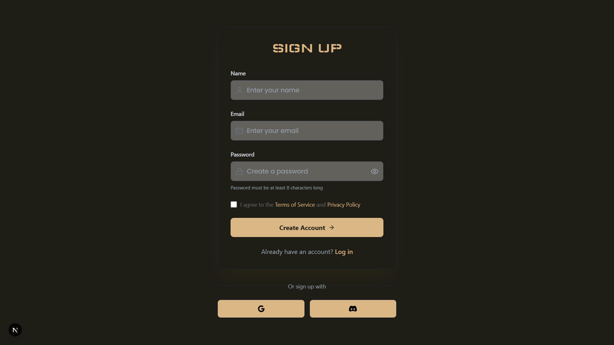
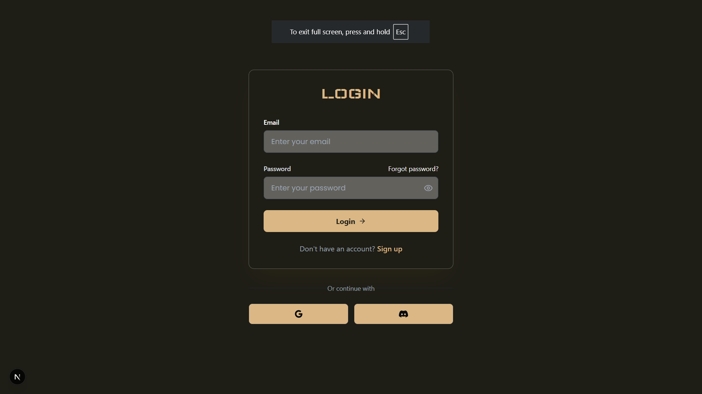
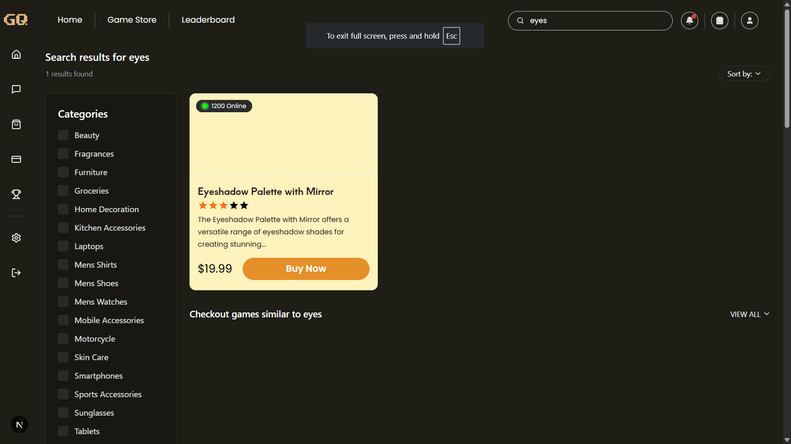
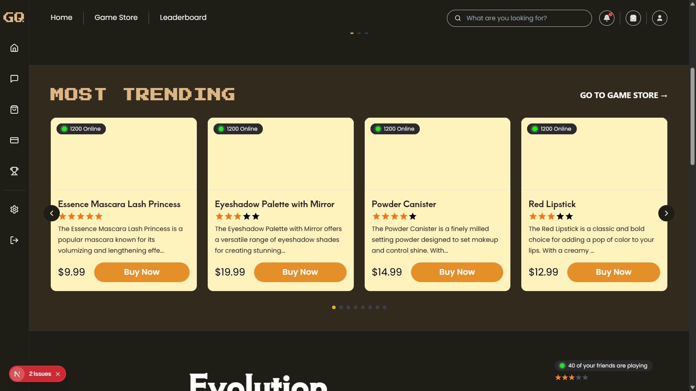
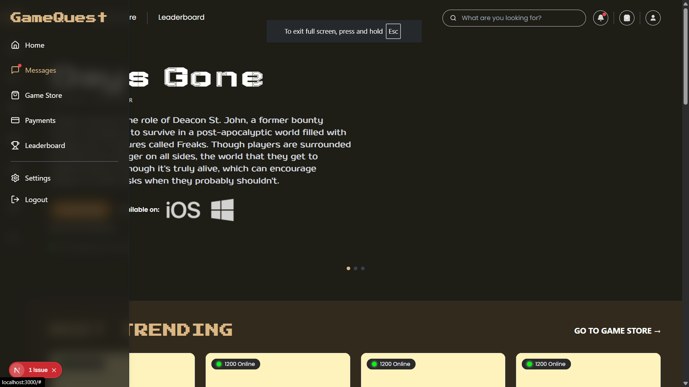

# Game Store Portal

## Project Overview

This project is a web-based **Game Store Portal** built with modern web technologies. Users can **Sign Up**, **Log In**, and browse a game catalog. The application features a responsive layout, a search bar with debouncing, dynamic filters, and a smooth sidebar animation. It implements client-side storage for user data and secure session management.

---

## Tech Stack

- **Next.js:** React framework for server-side rendering and static site generation.
- **Tailwind CSS:** Utility-first CSS framework for building modern UIs.
- **Axios:** Promise-based HTTP client for API interactions.
- **Redux:** State management library to handle app-wide data.
- **SweetAlert2:** Beautiful, customizable alerts and modals.
- **Lucide-React:** Lightweight icon library for React.
- **LocalStorage & SessionStorage:**
  - LocalStorage is used to persist user registration data.
  - SessionStorage is used for managing login sessions.

---

## Project Flow

### 1. User Visits the Portal

- User lands on the portal and is greeted with the option to **Sign Up** or **Log In**.

---

### 2. Sign Up

- New users can create an account by filling out the registration form.
- On successful signup, user data (like email, password) is saved in **LocalStorage**.
- Form validation ensures proper input before saving data.

---

### 3. Login

- Existing users can log in using credentials saved in **LocalStorage**.
- Login credentials are matched against stored data.
- After successful login, a session flag is saved in **SessionStorage** to maintain session.

---

### 4. Private Routing

- Pages are protected; unauthenticated users are redirected to the login page.
- The application checks **SessionStorage** on every route change to validate the user session.

---

### 5. Landing Page

- After successful login, users are redirected to the **Landing Page**.
- The landing page includes:
  - **Navbar** with navigation links.
  - **Search Bar** with debouncing functionality.
  - **Carousel** to display featured games.

---

### 6. Search Functionality

- Users can search for games using the search bar.
- The search input is **debounced** to optimize API calls and improve performance.

  

---

### 7. Game Store

- The **Game Store** page allows users to browse and filter games.
- **Categories** and **filters** are dynamic, helping users find games easily.

  

---

### 8. Sidebar Hover Animation

- The sidebar expands smoothly on hover, displaying additional navigation options.
- Implemented using Tailwind transitions for a polished UX.

  

---

## Code Quality

- The code is written cleanly and modularly.
- Proper file structure is maintained for components, pages, redux slices, and styles.
- Comments are added where necessary for better readability and maintainability.
